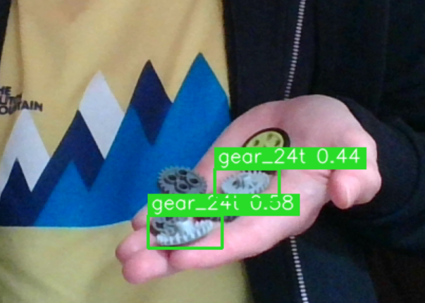
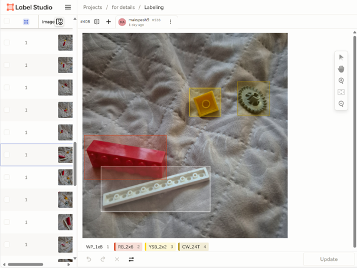
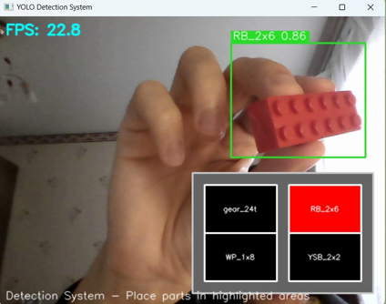

# Lego Parts Detection with YOLOv8


Computer Vision solution for organizing Lego construction kits, developed for Robotech School.

## 📖 Project Overview

This project aims to develop a Computer Vision-based solution to help junior robotics students organize their construction kits. The system serves as a foundation for expanding to other construction kits (such as Lego EV3 Mindstorms).

### Problem Statement
- **Kit organization**: Addressing cluttering issues in robotics kits
- **Time efficiency**: Reducing manual sorting time for teachers
- **Cost reduction**: Minimizing financial costs associated with kit maintenance

## 🖼️ Project Visuals

### Detection Examples
| | |
|:---:|:---:|
| **Gear Wheel Detection**<br> | **Structural Parts Detection**<br> |
| **Annotation Process**<br> | **Real-time Detection**<br> |

### Technical Implementation
| | |
|:---:|:---:|
| **Dataset Samples**<br> | **Results Comparison**<br> |

## 🛠️ Technology Stack

- **Python** - Primary programming language
- **Label Studio/CVAT** - Data annotation tools
- **YOLOv8** - Object detection model
- **OpenCV** - Computer vision library

## 📊 Results

### Model Performance
- ✅ **Successfully trained** YOLOv8 weights for recognizing parts across four sections
- ✅ **Visual indication** system implemented for part categorization
- ✅ **Real-time detection** with visual feedback

### Detection Accuracy
- 🏆 **Highest accuracy**: Gear wheel recognition
- ⚠️ **Challenges**: White plate (size 1x8) shows lower accuracy
- ❗ **Current issue**: Occasional false positives (hand detected as part)

## 🚀 Usage

### Detection Output
When a part is detected, the algorithm:
1. Identifies the Lego piece
2. Determines the appropriate section
3. Provides visual indication for placement
4. Displays confidence scores

### Example Output
```bash
Detected: Gear Wheel - Section: Mechanics - Confidence: 0.92
Detected: White Plate 1x8 - Section: Structural - Confidence: 0.76
